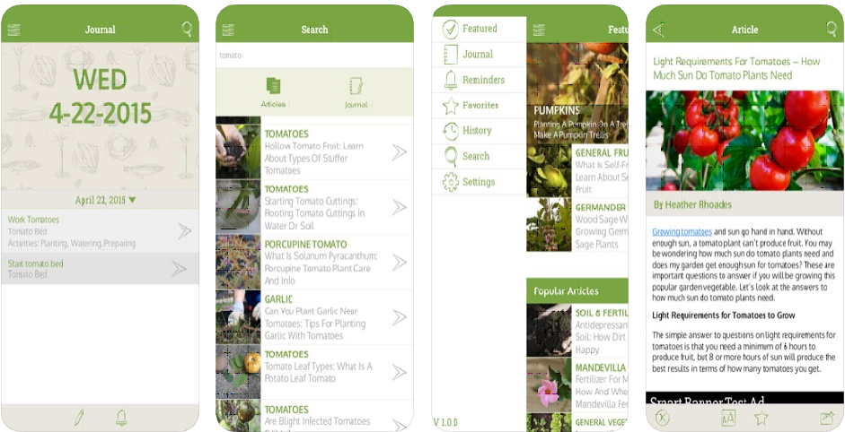
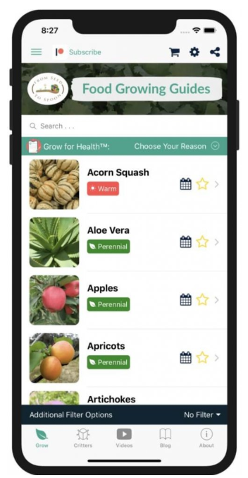
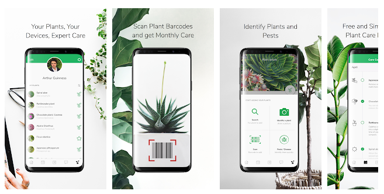
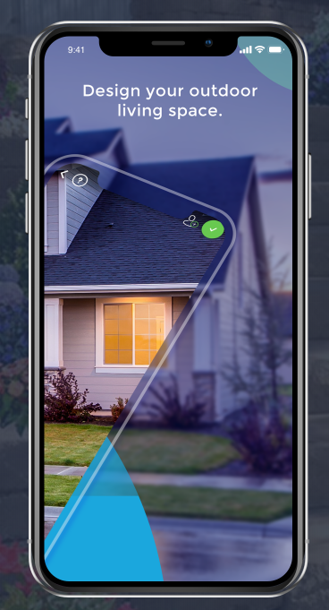

# CPSC Team Project

members:

- Brett Gattinger
- Eric Austin
- Lynn (Jiarong Xu)
- Rory Skipper
- Jack Wiebe

# Phase 1 - Investigate

## Green Thumb

The idea is an Android/iOS mobile application that functions as a gardening assistant. The app will utilize the full functionality of a modern smartphone to enable even the most green (pun intended) gardener to start and maintain a beautiful home garden, whatever that home may look like. The need for increased urban biodiversity is clear. Converting concrete to greenspace and monoculture lawns to diverse gardens promotes the health of bee populations, takes CO2 out of the atmosphere, and helps keep cities cool (literally). We already see a trend in this direction with new office towers and condos covered in trees and some cities replacing parking lots with parks. However, many more regular citizens will need to participate for this trend to make an impact. But keeping plants alive is not always so easy for the inexperienced, which is where Green Thumb comes in. The app will use the phone’s location data to determine the range of appropriate plants based on temperature, sunshine, and rainfall which is further refined by the answers to a few simple questions to the user, such as area available for planting and the orientation of the garden for sunshine. The user can select the desired plants from this range and the app will provide instructions on how to plant and even provide links for the purchase of the plants and needed extras (soil, watering can, plant food, etc.). Helpful instructional videos and friendly reminders to water will ensure that an amateur gardener can’t go wrong.

## Groceries

The idea is a grocery list app that will find the cheapest store to buy from. While it may be tempting to choose convenience over price the bill for groceries is unarguably one of the largest costs for household budgets. Yet with more and more retailers offering online shopping people shouldn’t have to choose between convenience and price, then again not everyone has the time to scour each grocers website and find the best price. “Groceries” solves the last hurdle to convenience by searching the online sites of grocers and creating an easily accessible compendium of price matching and comparisons thus allowing users to quickly and effortlessly determine the best place to buy the products they need most at the best price.

## Screen Time Control

This is an Android/iOS mobile app that gives parents control over kids screen time remotely. Parents have been trying hard to restrict the amount of time kids spend on their digital devices since kids are getting more and more addicted to electronic devices, but can’t always be present to police their childrens screentime. The study of National Institutes of Health has shown that brain changes among kids using screens more than seven hours a day lead to lower cognitive skills compared to those using screens for more than two hours a day. The purpose of this app is to give you an easy and effective way to keep track of their screen usage. Parents can remotely link to any of the registered devices that their children use, such as their smartphones, tablets and even the home TV or computer, and allows them not only monitor what they are doing with their cell phone, but also set a time limit on certain apps or even blocking them. It also allows you to locate your kids so that you can see their location on the map. Access to the devices can be manually toggled at any time through the controlling users phone or schedules for access which will be automatically enforced can be set in advance.
Balancing on screen time is becoming a difficult task not only for young kids, but also adults. If you are someone who has addiction spending time on social media, watching videos or playing video games. This app also provides you a chance to use as a time management tool with someone you trust, for example your family, girl/boyfriend etc.

# Phase 2

## Project Description

The project is a mobile application, specifically an iOS/Android app, tentatively called Green Thumb. The application is a gardening assistant. Even growing and taking care of a single plant can be a challenge for a novice gardener, so our application will utilize the full functionality of a modern smartphone to guide and assist users in starting and maintaining a garden.

The app will help users select which plants to grow based on geolocation and responses to some simple questions, such as area available for garden. A list of needed materials (eg. seeds, soil, flower pots, etc.) will be given based on selected plants with links to retailers (eg. Amazon, Canadian Tire) that sell supplies. Step-by-step instructions will be provided for planting along with demonstration videos. The app will maintain a virtual twin of your garden with the ability to add or drop plants as the real world garden changes, with support for multiple gardens (eg. plants in my office at work, seasonal garden in my backyard, year round house plants etc). The app will have a reminder schedule and activity calendar so that the user never forgets to water a plant or weed the garden. If a plant is not growing like it should, a user can query the app for help diagnosing the problem. In short, the app provides all the functionality that a total beginner would need to start growing a few plants but will have a level of customisation to enable more experienced gardeners to curate the assistance they receive.

## Stakeholders

- Users with no gardening experience - these users will need lots of hand-holding throughout the process and will rely heavily on information provided and reminders.

- Users with gardening experience - these users already have a good grasp of gardening and will only need to reference the certain needs or perhaps the reminders.

- Retailers who partner with the app to sell gardening supplies - these partners will get a potential stream of customers and in exchange should be willing to offer discounts or promotions. Data privacy concerns in this relationship.

- Community garden associations - these users will not directly manage a garden but might interact with other users of the garden such as issuing watering reminders, supplying advice, or providing other services to gardeners.

- App developers who have to implement features - the developers are actually responsible for implementing this idea so our proposed features must be plausibly realizable.

## Research Methods

### Extreme User Interviews

Interviews were conducted with gardeners from all ranges of age and experience. We learned a lot about what gardeners consider important such as growing organic foods, using fewer chemical fertilizers, or getting schedules for when to harvest from their garden. These extreme user interviews highlighted the difference between those who didn’t garden in the past (or had very little experience) and those who were more knowledgeable. Something that was really interesting to note from the expert gardeners was that they aim to only plant things that feed the bees or the birds. This is to help support the ever-lowering bee population which people aren’t paying enough attention to. This and a couple other things like annual vs perennial plants and which plants like fertilizer helped us to better understand what information our app could help beginner gardeners with. Especially in the process of placing plants, our app could show in the virtual garden the radius in which the plant will eventually grow to, so that gardeners won’t mistakenly grow plants too close to one another.

### Survey

A survey was conducted of potential app users. The use of a survey was justified as it is a cheap, uniform way to get some important basic data about prospective users. The survey was shared online with one set of questions for respondents indicating no gardening experience and another set of questions for those indicating some gardening experience. Both groups identified lack of knowledge and forgetting to care for plants as the biggest obstacles, but non-experienced gardeners also thought lack of time would be a hurdle as well. These are all areas where our app would help. Both groups thought gardening is/would be not easy and are only willing to spend a small amount of money or time on the activity, although most did express an interest in an app that could help them with growing plants.

### Competitive Analysis IDEO method

We downloaded and tried a selection of existing gardening apps to get an idea of what has been done and what works well.

{: .callout}

- **Gardening Companion**(iOS) provides a lot of information and allows for custom notifications. Multiple gardens can be tracked and a built-in journal allows for unstructured note taking. However, the volume of information is overwhelming and the custom reminders and journal have no pre-existing templates so must be created from scratch, which is overwhelming.

  

- **From Seed to Spoon**(Android) provided a pretty comprehensive gardening assistant, but was lacking key information such as the soil type needed for a plant. Without this detailed information a novice will quickly end up with dead plants.

  

- **SmartPlant**(Android) purports to do a lot of what we are proposing to, however no assistance is provided in setting up a garden. A user merely selects plants from a huge list. The best feature of the app could be the human provided assistance, such as sending in a picture of a plant for identification. However, the 2.8 star rating on the app store was accompanied by many negative reviews complaining of a long wait for responses (hours to weeks). An automated expert system could be more effective.

  

- **iScape** (iOS) allows you design how your garden looks like before the project even starts using augmented reality 3D which provides a great amount of images of plants that you can place directly on the scene that you want to work on; or using traditional 2D way which allows you to overlay the plants on top of your picture. It offers you a great way to visualize the results and plan out what to buy and how to put it together, however you still need to do extra research on for example, what kind of plants grow well in the condition of your place or in terms of different seasons, etc. In addition, the entire app is lack of instruction, user has to learn and explore some functions by themselves.

  

While these apps all offer some of the features we believe should make up a proper gardening assistant, none had them all and many key features were missing. Ease-of-use was the biggest issue with these apps and will be a big challenge in designing our app given the number of features we are planning on including.

### Try It Yourself IDEO method

We used the *Try It Yourself *IDEO research method to gather more insight into what problems the user might have while using a mobile gardening companion app while doing day to day gardening tasks. Towards this end we let one of our researchers do their daily watering while tasked with using their smartphone as a simulation. This research yielded the following insights:

- When watering plants a large heavy bottle was used that at times takes two hands to pour. It wouldn’t be practicable for somebody to also carry their phone with them while watering. This suggests that any watering tracking/reminder feature needs to happen either before or after the watering has been done, and not during.

- We noticed that some of my plants did not need to be watered each day and were skipped.

- One of the plants has been doing very poorly since it was transplanted a few months ago and the researcher wasn’t sure if it was because it was under/over watered, the soil type was wrong, or if it just needed more fertilizer. An app that can ‘debug’ those questions would be really useful here.

- The researchers ‘garden’ is not a rectangle plot but is scattered all over the home in pots. If an app was going to show a visual representation of this garden it would need to be able to display all the plants but recreating the entire house might not be a good idea. We should research some different abstractions that could be used to represent indoor gardens.

- Some plants were noticed to be growing outside of the pot. The researcher wanted to prune them back but didn’t have the knowledge about how to do it properly. An app that could help guide through this routine task would be great.

## Reflections on Research Methods

### Interviews

While doing the interviews it was harder than expected to find appropriate people to interview about gardening. One surprise was that so many people we interview had some prior experience gardening, and even those who said they had no interest in gardening said that they had owned a plant, or had tried gardening in the past. Interviewing an expert gardener I found that they had almost an unlimited amount of information. The interview went much longer than it should’ve but it did give a lot of good information to include in the app.

### Surveys

It was difficult to come up with questions for the survey. We wanted the questions to have quantifiable answers so that the responses could be aggregated, but none of us are experienced gardeners (or designers) so it was a bit of a struggle and took lots of brainstorming. We knew we wanted to get data on what stops people from gardening and what they would find useful in an app, but for this data to be meaningful we need a lot of responses. This also proved a challenge as not as many people as hoped wanted to take time out of their day to answer a survey about gardening. Next time, it might be worthwhile to physically solicit responses with an offer of free coffee or donuts to try to get more responses, although this adds to the cost and effort.

### Competitive Analysis IDEO method

The competitive analysis was easier to do. It could be split among the team members and all of the apps were available for free (at least the basic versions). It didn’t take too long to identify the strengths and weaknesses for the various apps. We were able to identify ideas we would like to "borrow" (AR visualization of your garden) and features we have that nobody else does (geolocation refinement of plant selection). For an app, this type of competitive analysis is vital, although it may not be possible with something cutting edge that has no real competitors.

### Try It Yourself IDEO method

While performing the try it yourself it was hard to imagine how a final mobile app would be used at the same time as watering or harvesting from a garden. Either the tasks are so physically demanding that they cannot be done while holding a phone, or the phone needs to be placed on the ground where it might get water or dirt on it. It was hard to think outside the box while doing try it yourself when we already had a rigid idea of what the application would do.

## Task List

### Task Descriptions

1. Veronica is an inexperienced gardener who is looking for help setting up a small flower trough on her apartment balcony. She pulls out her smartphone and starts the Green Thumb app for guidance on how to do so. The app provides a selection of appropriate plants for her to choose from. She does so and now has a virtual twin of her soon-to-be garden.

2. Henry is an experienced gardener who knows exactly what he would like to plant in his large garden in the backyard of his house. He would like to track his garden, however, so he pulls out his smartphone and starts the Green Thumb app to create the garden. He skips over the help and creates the virtual twin directly.

3. Veronica has a virtual version of her garden in the app, but now needs to know what supplies are required to start this garden in real life. The app provides a complete list of supplies (eg. flower trough, seeds, soil, fertilizer, spade, etc.) for her to view.

4. Veronica has a list of needed supplies and now needs to obtain these supplies. She is able to order these through the app for prompt delivery.

5. Veronica has her virtual garden and supplies and is now ready to start planting. She doesn't know how to plant a flower and uses the app to get instructions on how to do so and references the app throughout the planting process until her garden is ready.

6. Henry has decided to add a small tree to his yard and would like to track this in the app. He opens the app on his phone and selects and adds the specific tree to his virtual garden.

7. Henry’s potatoes are ready so he harvests and would like to reflect this change in his virtual garden. He opens the app and removes his potato plant from his garden.

8. Veronica feels that she will need help remembering when to water her flowers. She sets up reminders in her app and adds the watering schedule to her calendar. When the app notifies her, she waters her flowers and confirms on the app for tracking.

<table>
  <tr>
    <td>Task Description</td>
    <td>Requirements</td>
    <td>Complex?</td>
    <td>Frequency</td>
  </tr>
  <tr>
    <td>Start a garden with help</td>
    <td>
<ul>
<li>Create account</li>
<li>Determine suitable plants</li>
<li>Select plants</li>
<li>Create garden</li>
</ul>

</td>
    <td>Complex</td>
    <td>Infrequent but important</td>
  </tr>
  <tr>
    <td>Start garden without help</td>
    <td>
<ul>
<li>Create account</li>
<li>Skip help</li>
<li>Select plants</li>
<li>Create garden</li>
</ul>

</td>
    <td>Complex</td>
    <td>Infrequent but important</td>
  </tr>
  <tr>
    <td>Obtain list of required gardening supplies</td>
    <td><ul>
<li>generate list of required supplies</li>
</ul>
</td>
    <td>Not complex</td>
    <td>Infrequent but important</td>
  </tr>
  <tr>
    <td>Order/purchase gardening supplies</td>
    <td><ul>
<li>provide links for purchasing that can be selected for chosen supplies</li>
</ul>

</td>
    <td>Complex</td>
    <td>Infrequent but important</td>
  </tr>
  <tr>
    <td>Get instructions on planting</td>
    <td><ul>
<li>video instructions</li>
<li>text instructions</li>
</ul>
</td>
    <td>Not complex</td>
    <td>Routine</td>
  </tr>
  <tr>
    <td>Add a plant to your garden</td>
    <td><ul>
<li>search for plant</li>
<li>select from list</li>
</ul>
</td>
    <td>Not complex</td>
    <td>Routine</td>
  </tr>
  <tr>
    <td>Remove a plant from your garden</td>
    <td><ul>
<li>select plant from garden to delete</li>
</ul>
</td>
    <td>Not complex</td>
    <td>Routine</td>
  </tr>
  <tr>
    <td>Set up and action reminders</td>
    <td><ul>
<li>recommended schedule based on plants and environment</li>
<li>custom schedule</li>
<li>export to calendar programs</li>
<li>action reminders for tracking</li>
</ul>
</td>
    <td>Not complex</td>
    <td>Routine</td>
  </tr>
</table>

