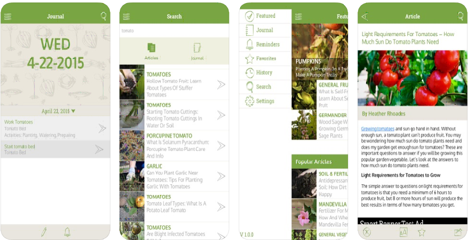
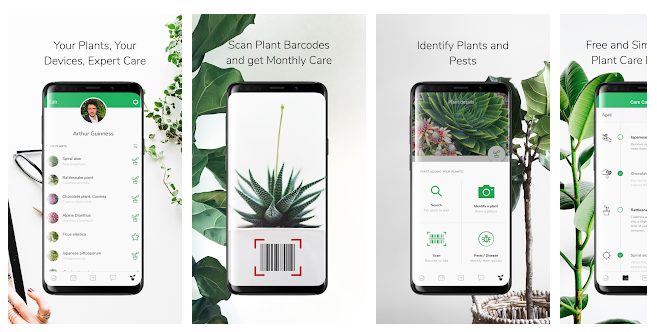

# Green Thumb

- Eric Austin
- Jackson Cougar Wiebe
- Lynn (Jiarong Xu)
- Rory Skipper

# Executive Summary

The problem that we are trying to design a solution for is how to get people educated and interested in gardening. To better understand this problem, we conducted interviews with with gardeners from all ranges of age and experience, conducted surveys, performed secondary research, and performed our own try-it-yourself research. From our findings we found that most users had very limited time and wanted an app that would be able to teach them new things about gardening. From this research we produced an lo-fi prototype and a high-fi prototype. We received a heuristic evaluation on our high-fidelity prototype that highlighted several problems that we had to fix right away. In the end we produced a very able high-fidelity prototype that showcases our approach to teaching people how to garden.

## Design Problem

Our design problem was to design and prototype a mobile application that functions as a gardening assistant. The goal is to enable even the least skilled gardener to successfully grow and maintain a garden through the use of our app, Green Thumb. The app helps users by recommending suitable plants to grow based on the user’s location, providing a list of recommended supplies with ability to purchase, planning garden layout with virtual representation, step-by-step written and video instructions, social media posts and community help, and harvesting and watering reminders.

## End Users and Stakeholders
We have identified the following end users:

- Newcomers to gardening
- Intermediate gardeners
- Expert gardeners and community gardeners
In addition to these end users, we have identified the following stakeholders:
- Developers who will implement the application
- Retailers of garden supplies

## User Research and Findings
We conducted four different IDEO research methods: 

- Extreme User Interviews - Interviews were conducted with gardeners from all ranges of age and experience. We learned a lot about what gardeners consider important such as growing organic foods, using fewer chemical fertilizers, or getting schedules for when to harvest from their garden.
- Competitive Analysis - We downloaded and tried a selection of existing gardening apps to get an idea of what has been done and what works well.
- Try It Yourself - Try gardening while using a phone to gather more insight into what problems the user might have while using a mobile gardening companion app while doing day to day gardening tasks.
Survey - A survey was conducted of potential app users.

## Design and Justification
Here are the major design decisions that we made during the UCD process:

- Smartphone application vs website - a mobile application was chosen for better functionality and usability and for the fact that people are more likely to use an app than sit down at their desktop computer for simple tasks. Can’t take your computer outside when you garden.
- Focus on the novice user - provide enough functionality that a user with zero experience can start gardening but make the app flexible enough that someone with more experience has more freedom.
- Linking to outside services - connect the app to Facebook/social media, Google maps, online shopping to provide more functionality but keep these features optional to respect user privacy preferences.
- Community based/crowd sourced help - allow users to help each other identify plant growing issues via social media rather than attempt AI solution or paid professional solution.
- Subdued, sophisticated look - natural colours and professional look rather than too bright or cartoony.
Virtual garden representation - full 3D virtual garden rather than a basic grid representation.

## Heuristic Evaluation and Findings
We exchanged prototypes with another group in class and they found the following issues with our prototype:

- Important - lack of documentation/explanation of functionality, restricted navigation, basic nature of our virtual garden representation, broken/missing links in the Adobe XD project. These were fixed before the final submission.
- Less important - non-clickable elements on the main page and lack of undo/redo. These were not remedied given time constraints.
- Suggestions for future projects - aesthetic issues such as the main page was busy/cluttered and that the background image was distracting and visually overpowering.

## Recommendations for Next Iteration of Design

These are the features/improvements we would look at during a second design iteration:

- More user feedback on layout and background design to determine whether it is too busy/cluttered/distracting
- Adding more functionality to the prototype such as multiple gardens 
- Adding the ability to create different types of social media posts, not just help posts
- Augmented reality garden view eg. how would my real world garden look with this plant here?

# Introduction 

## Design Problem

The problem that we are trying to design a solution for is how to get people educated and interested in gardening. Not only is gardening great for decreasing stress and general well-being, but by nurturing an interest in nature and growing things we may be able to increase an awareness and respect for nature in society. The current state of the art in mobile apps gives users access to an encyclopedia of knowledge that can be searched on demand. However, the gap here is that there is not enough expert guidance for newcomers who don’t know enough to even know what questions they need answers to!

The solution that we are looking for is one that guides and nurtures interest in growing living things for people of all skills and backgrounds. We propose to create an app that by gathering the user’s data and information can provide personalized advice, and time-sensitive alerts along their journey in gardening.

The project is a mobile application called Green Thumb. The application is a gardening assistant. Even growing and taking care of a single plant can be a challenge for a novice gardener, so our application will utilize the full functionality of a modern smartphone to guide and assist users in starting and maintaining a garden.

The app will help users select which plants to grow based on geolocation and responses to some simple questions, such as area available for garden. A list of needed materials (eg. seeds, soil, flower pots, etc.) will be given based on selected plants with links to retailers (eg. Amazon, Canadian Tire) that sell supplies. Step-by-step instructions will be provided for planting along with demonstration videos. The app will maintain a virtual twin of your garden with the ability to add or drop plants as the real world garden changes, with support for multiple gardens (eg. plants in my office at work, seasonal garden in my backyard, year round house plants etc). The app will have a reminder schedule and activity calendar so that the user never forgets to water a plant or weed the garden. If a plant is not growing like it should, a user can query the app for help diagnosing the problem. In short, the app provides all the functionality that a total beginner would need to start growing a few plants but will have a level of customization to enable more experienced gardeners to curate the assistance they receive.

## End-users and stakeholders

{: .callout}
-	Newcomers to gardening like young adults who are looking to grow plants recreationally. These people might not have any prior knowledge about gardening, but they are willing to try it if they feel like they have the advice and guidance to succeed.
  
    

-	Intermediate gardeners who already have some prior experience but are seeking to get better at gardening. These users know the basics but are looking for best-practices or expert advice. They may be looking to try growing something new or more challenging and need guidance to take the leap.

    

-	Expert gardeners and community gardeners. These people might have more knowledge about gardening, but what sets them apart from the others is that they want to grow on a larger scale. These people need help arranging large garden beds and require advice about what types of plants will grow best with others.

    

-	Developers who will implement the application must be able to produce the final application. These people require that we don’t create an application that is impossible to produce in a reasonable span of time.

    

-	Retailers of garden supplies and seeds would have a stake in the success of our app and may want to partner with us to provide sales, curate advice, or offer expert reviews.

    

## User Research and Findings

### Extreme User Interviews

Interviews were conducted with gardeners from all ranges of age and experience. We learned a lot about what gardeners consider important such as growing organic foods, using fewer chemical fertilizers, or getting schedules for when to harvest from their garden.

<fig> Word cloud generated from the transcripts of our interviews </fig>

These extreme user interviews highlighted the difference between those who didn’t garden in the past (or had very little experience) and those who were more knowledgeable. Something that was really interesting to note from the expert gardeners was that they aim to only plant things that feed the bees or the birds. This is to help support the ever-lowering bee population which people aren’t paying enough attention to. This and a couple other things like annual vs perennial plants and which plants like fertilizer helped us to better understand what information our app could help beginner gardeners with. Especially in the process of placing plants, our app could show in the virtual garden the radius in which the plant will eventually grow to, so that gardeners won’t mistakenly grow plants too close to one another.

Below is a listing of recording for all interviews conducted:

- A interview

  <audio controls source src="assets\clips\ben-interview.ogg">
  
Your browser does not support the audio element.

  </audio>

- B interview

  <audio controls source src="assets\clips\Bonnie Interview - Expert.ogg">
  
Your browser does not support the audio element.

  </audio>

- C interview

  <audio controls source src="assets\clips\Kathy Interview - Intermediate.ogg">
  
Your browser does not support the audio element.

  </audio>

- D interview

  <audio controls source src="assets\clips\matt-interview.ogg">
  
Your browser does not support the audio element.

  </audio>

- E interview

  <audio controls source src="assets\clips\micah-interview.ogg">
  
Your browser does not support the audio element.

  </audio>

### Survey

A survey was conducted of potential app users. The use of a survey was justified as it is a cheap, uniform way to get some important basic data about prospective users. The survey was shared online with one set of questions for respondents indicating no gardening experience and another set of questions for those indicating some gardening experience. Both groups identified lack of knowledge and forgetting to care for plants as the biggest obstacles, but non-experienced gardeners also thought lack of time would be a hurdle as well. These are all areas where our app would help. Both groups thought gardening is/would be not easy and are only willing to spend a small amount of money or time on the activity, although most did express an interest in an app that could help them with growing plants.

  

    

      
    

    

      
    

    

      
    

    

      
    

    

      
    

    

      
    

    

      
    

    

      
    

    

      
    

    

      
    

    

      
    

    

      
    

    

      
    

    

      
    

    

      
    

    

      
    

    

      
    

  

[Click to view full survey results.](https://docs.google.com/viewer?url=https://jacksoncougar.github.io/CPSC-481/assets/pdfs/survey-report.pdf)

### Competitive Analysis IDEO method

We downloaded and tried a selection of existing gardening apps to get an idea of what has been done and what works well.

{: .callout}

- **Gardening Companion**(iOS) provides a lot of information and allows for custom notifications. Multiple gardens can be tracked and a built-in journal allows for unstructured note taking. However, the volume of information is overwhelming and the custom reminders and journal have no pre-existing templates so must be created from scratch, which is overwhelming.

  

- **From Seed to Spoon**(Android) provided a pretty comprehensive gardening assistant, but was lacking key information such as the soil type needed for a plant. Without this detailed information a novice will quickly end up with dead plants.

  

- **SmartPlant**(Android) purports to do a lot of what we are proposing to, however no assistance is provided in setting up a garden. A user merely selects plants from a huge list. The best feature of the app could be the human provided assistance, such as sending in a picture of a plant for identification. However, the 2.8 star rating on the app store was accompanied by many negative reviews complaining of a long wait for responses (hours to weeks). An automated expert system could be more effective.

  

- **iScape** (iOS) allows you design how your garden looks like before the project even starts using augmented reality 3D which provides a great amount of images of plants that you can place directly on the scene that you want to work on; or using traditional 2D way which allows you to overlay the plants on top of your picture. It offers you a great way to visualize the results and plan out what to buy and how to put it together, however you still need to do extra research on for example, what kind of plants grow well in the condition of your place or in terms of different seasons, etc. In addition, the entire app is lack of instruction, user has to learn and explore some functions by themselves.

  

While these apps all offer some of the features we believe should make up a proper gardening assistant, none had them all and many key features were missing. Ease-of-use was the biggest issue with these apps and will be a big challenge in designing our app given the number of features we are planning on including.

### Try It Yourself IDEO method

<fig> Our researchers home-garden </fig>

We used the _Try It Yourself_ IDEO research method to gather more insight into what problems the user might have while using a mobile gardening companion app while doing day to day gardening tasks. Towards this end we let one of our researchers do their daily watering while tasked with using their smartphone as a simulation. This research yielded the following insights:

- When watering plants a large heavy bottle was used that at times takes two hands to pour. It wouldn’t be practicable for somebody to also carry their phone with them while watering. This suggests that any watering tracking/reminder feature needs to happen either before or after the watering has been done, and not during.

- We noticed that some of the plants did not need to be watered each day and were skipped that day.

- One of the plants has been doing very poorly since it was transplanted a few months ago and the researcher wasn’t sure if it was because it was under/over watered, the soil type was wrong, or if it just needed more fertilizer. An app that can ‘debug’ those questions would be really useful here.

- The researchers ‘garden’ is not a rectangle plot but is scattered all over the home in pots. If an app was going to show a visual representation of this garden it would need to be able to display all the plants but recreating the entire house might not be a good idea. We should research some different abstractions that could be used to represent indoor gardens.

- Some plants were noticed to be growing outside of the pot. The researcher wanted to prune them back but didn’t have the knowledge about how to do it properly. An app that could help guide through this routine task would be great.

### Reflections on Research Methods

#### Interviews

While doing the interviews it was harder than expected to find appropriate people to interview about gardening. One surprise was that so many people we interview had some prior experience gardening, and even those who said they had no interest in gardening said that they had owned a plant, or had tried gardening in the past. Interviewing an expert gardener I found that they had almost an unlimited amount of information. The interview went much longer than it should’ve but it did give a lot of good information to include in the app.

#### Surveys

It was difficult to come up with questions for the survey. We wanted the questions to have quantifiable answers so that the responses could be aggregated, but none of us are experienced gardeners (or designers) so it was a bit of a struggle and took lots of brainstorming. We knew we wanted to get data on what stops people from gardening and what they would find useful in an app, but for this data to be meaningful we need a lot of responses. This also proved a challenge as not as many people as hoped wanted to take time out of their day to answer a survey about gardening. Next time, it might be worthwhile to physically solicit responses with an offer of free coffee or donuts to try to get more responses, although this adds to the cost and effort.

#### Competitive Analysis IDEO method

The competitive analysis was easier to do. It could be split among the team members and all of the apps were available for free (at least the basic versions). It didn’t take too long to identify the strengths and weaknesses for the various apps. We were able to identify ideas we would like to "borrow" (AR visualization of your garden) and features we have that nobody else does (geolocation refinement of plant selection). For an app, this type of competitive analysis is vital, although it may not be possible with something cutting edge that has no real competitors.

#### Try It Yourself IDEO method

While performing the try it yourself it was hard to imagine how a final mobile app would be used at the same time as watering or harvesting from a garden. Either the tasks are so physically demanding that they cannot be done while holding a phone, or the phone needs to be placed on the ground where it might get water or dirt on it. It was hard to think outside the box while doing try it yourself when we already had a rigid idea of what the application would do.

### Tasks

{: .circle}

&nbsp;

#### Task Descriptions

1. Veronica is an inexperienced gardener who is looking for help setting up a small flower trough on her apartment balcony. She pulls out her smartphone and starts the Green Thumb app for guidance on how to do so. The app provides a selection of appropriate plants for her to choose from. She does so and now has a virtual twin of her soon-to-be garden.

2. Henry is an experienced gardener who knows exactly what he would like to plant in his large garden in the backyard of his house. He would like to track his garden, however, so he pulls out his smartphone and starts the Green Thumb app to create the garden. He skips over the help and creates the virtual twin directly.

3. Veronica has a virtual version of her garden in the app, but now needs to know what supplies are required to start this garden in real life. The app provides a complete list of supplies (eg. flower trough, seeds, soil, fertilizer, spade, etc.) for her to view.

4. Veronica has a list of needed supplies and now needs to obtain these supplies. She is able to order these through the app for prompt delivery.

5. Veronica has her virtual garden and supplies and is now ready to start planting. She doesn't know how to plant a flower and uses the app to get instructions on how to do so and references the app throughout the planting process until her garden is ready.

6. Henry has decided to add a small tree to his yard and would like to track this in the app. He opens the app on his phone and selects and adds the specific tree to his virtual garden.

7. Henry’s potatoes are ready so he harvests and would like to reflect this change in his virtual garden. He opens the app and removes his potato plant from his garden.

8. Veronica feels that she will need help remembering when to water her flowers. She sets up reminders in her app and adds the watering schedule to her calendar. When the app notifies her, she waters her flowers and confirms on the app for tracking.

<table>
  <tr>
    <td>Task Description</td>
    <td>Requirements</td>
    <td>Complex?</td>
    <td>Frequency</td>
  </tr>
  <tr>
    <td>Start a garden with help</td>
    <td>
<ul>
<li>Create account</li>
<li>Determine suitable plants</li>
<li>Select plants</li>
<li>Create garden</li>
</ul>

</td>
    <td>Complex</td>
    <td>Infrequent but important</td>
  </tr>
  <tr>
    <td>Start garden without help</td>
    <td>
<ul>
<li>Create account</li>
<li>Skip help</li>
<li>Select plants</li>
<li>Create garden</li>
</ul>

</td>
    <td>Complex</td>
    <td>Infrequent but important</td>
  </tr>
  <tr>
    <td>Obtain list of required gardening supplies</td>
    <td><ul>
<li>generate list of required supplies</li>
</ul>
</td>
    <td>Not complex</td>
    <td>Infrequent but important</td>
  </tr>
  <tr>
    <td>Order/purchase gardening supplies</td>
    <td><ul>
<li>provide links for purchasing that can be selected for chosen supplies</li>
</ul>

</td>
    <td>Complex</td>
    <td>Infrequent but important</td>
  </tr>
  <tr>
    <td>Get instructions on planting</td>
    <td><ul>
<li>video instructions</li>
<li>text instructions</li>
</ul>
</td>
    <td>Not complex</td>
    <td>Routine</td>
  </tr>
  <tr>
    <td>Add a plant to your garden</td>
    <td><ul>
<li>search for plant</li>
<li>select from list</li>
</ul>
</td>
    <td>Not complex</td>
    <td>Routine</td>
  </tr>
  <tr>
    <td>Remove a plant from your garden</td>
    <td><ul>
<li>select plant from garden to delete</li>
</ul>
</td>
    <td>Not complex</td>
    <td>Routine</td>
  </tr>
  <tr>
    <td>Set up and action reminders</td>
    <td><ul>
<li>recommended schedule based on plants and environment</li>
<li>custom schedule</li>
<li>export to calendar programs</li>
<li>action reminders for tracking</li>
</ul>
</td>
    <td>Not complex</td>
    <td>Routine</td>
  </tr>
</table>

## Design and Justification

### low fidelity prototype

<iframe width="100%" height="515" src="https://www.youtube-nocookie.com/embed/_4P7GoLHudg" frameborder="0" allow="accelerometer; autoplay; encrypted-media; gyroscope; picture-in-picture" allowfullscreen></iframe>

[see lo-fi prototype.](docs\lofi-prototype.html)

### Report

[ Click to view low fidelity prototype report ](https://docs.google.com/viewer?url=https://jacksoncougar.github.io/CPSC-481/assets/pdfs/Deliverable%203%20ppt.pdf)

### Reflections on Ideating and Prototyping

We did brainstorming via sketching. This was a new type of activity for most of our group as we
don’t come from an art or design background. Initially there was a bit of a block as we wondered
what we should be sketching. How the app is used? What the layout should be? In the end we
learned that there is no ‘right’ way to brainstorm and that we should let our minds roam free and
do many sketches of all aspects of the design.

The task walkthroughs were a useful way to identify problems in the design once we had
identified which tasks we wanted our app to allow the user to complete. For example, we
identified a couple of places where we need to make a tradeoff between having more options on
one screen (could be cluttered or overwhelming) or have a series of screens with nested options
(could be confusing).

The lo-fi prototyping was an enjoyable process and Balsamiq was very easy to use so we didn’t
run into too many problems. However, we should have had a clearer idea of how we wanted the
app to be laid out and flow before starting in Balsamiq. Seeing it in Balsamiq did help us refine
out ideas though.

### Sketches

  

    

      
      <fig>Watering reminders</fig>
    

    

      
      <fig>Watering alerts bsaed on weather</fig>
    

    

      
      <fig>Step by step planting advice</fig>
    

    

      
      <fig>Virtual reality repreesntation of garden with interactive avatars.</fig>
    

    

      
      <fig>Clean aesthetic</fig>
    

    

      
      <fig>Help and advice</fig>
    

    

      
      <fig>Watering history and reminders</fig>
    

    

      
      <fig>Recommendations based on individualized data</fig>
    

    

      
      <fig>Various interactions</fig>
    

  

#### Storyboard 

[ Click to view complete storyboard ](https://docs.google.com/viewer?url=https://jacksoncougar.github.io/CPSC-481/assets/pdfs/storyboard.pdf)

### Task Centered Design walkthrough

## High-fidelity prototype

{: .callout}
-   

    

[Adobe XD high-fidelity prototype](https://xd.adobe.com/view/26323145-283c-4e07-7698-6bc4ba6b76f6-5003/)

## Heuristic Evaluation and Findings

[ Click to view Heuristic Evaluation report ](https://docs.google.com/viewer?url=https://jacksoncougar.github.io/CPSC-481/assets\pdfs\Deliverable 4 presentation.pptx)

We exchanged prototypes with another team in our tutorial. We evaluated their prototype and they evaluated ours. The idea is to have them test the app out as users would and identify issues. We could then improve our prototype based on their feedback. However, we did not receive their feedback until the afternoon of Nov 24, ie. The day the deliverable was due. Because of this, our ability to fix the issues they identified was essentially nil. However, there was significant overlap between the important issues that they identified and what we found with the help of our TA in the final tutorial before the due date. Even though it was too late to be much help for this deliverable, there is still value in reviewing their feedback for improving the prototype for the final deliverable/presentation and for deepening our understanding of the User Centred Design process.

Time is always a constraint for any project, so prioritizing issues is key. More important issues should be fixed first and less important issues can wait. We can thus categorize the identified issues into three broad categories:
- Important – must be fixed before submitting prototype
- Less important – can wait to be fixed for the final deliverable
- Suggestions for future projects – lessons to keep in mind for our next design project

## The design changes that made based on the heuristic evaluation

The two biggest issues the other team identified were (1) lack of documentation/explanation of functionality and (2) restricted navigation. While we tried to make the functionality of the app match common mobile pardigms, it was useful to hear that others found it confusing. 

1. We thus added more text explanations of the various functions on each page. 
   
   
   <fig>Help text added to many screens</fig>

2. They also noted that there was no easy way to navigate back to the home page. It would take possible several taps of the back button to get home, depending on the page a user is on. To fix this, we made the “Green Thumb” logo on each page clickable for navigation back to the home page.
   
   
   <fig>Clicking on the logo brings you back to the main screen</fig>

A third major issue that we identified with the TA was the basic nature of our virtual garden representation. Our brainstorming/ideation had given us the idea of having a full virtual and graphical depiction of a garden with the ability to drag and drop plants and plan the garden. Our lo-fi and initial hi-fi prototypes instead used a simpler rectangular grid representation. The TA Brandon felt that our original idea was more nnovative and that the simpler design dragged down the overall impact of our app. We thus implemented the more detailed and realistic virtual garden.

   
   <fig> Fully 3d virtual representation of the virtual garden</fig>

There were numerous other issues that ended up being broken/missing links in the Adobe XD project. While these were simple to fix, they were important since they needed to be fixed before submission of deliverable.

There were two main issues in the “Less Important” category: non-clickable elements on the main page, and lack of undo/redo. These would be nice to fix/implement given the time.

The category of “Suggestions for future projects” consists of the aesthetic issues raised by the heuristic evaluation. The two main ones were that the main page was busy/cluttered and that the background image was distracting and visually overpowering. While these issues are very subjective (we quite like the background image and find the main page does a good job of presenting some relevant information) it is important to consider many different opinions since we hope to have many different users.

The feedback we received from the heuristic evaluation was very useful and we have already made some improvements based on the feedback. It was unfortunate that we received the feedback on the same day the deliverable was due and couldn’t take full advantage of it.

## Recommendations for Next Iteration of Design

We feel that we were quite successful in creating a hi-fi prototype that covered that majority of the functionality that we outlined earlier in the semester and that the aesthetic design is quite close to the professional quality you would see on actual apps on the app store. However, there is still lots of room for improvement so the following areas would be looked at if the design process were carried out through another iteration:

- More user feedback on layout and background design to determine whether it is too busy/cluttered/distracting
- Adding more functionality to the prototype such as multiple gardens 
- Adding the ability to create different types of social media posts, not just help posts
- Augmented reality garden view eg. how would my real world garden look with this plant here?

- In the future we need to implement better teaching aids such as step-by-step guides. Using the phone camera the user could document their progress and receive feedback on how well they did.

- If the app used AR toolkit a plant inspector feature could be built that uses the camera of the phone to create an augmented view of whatever plant it is looking at and automatically detect and report on any issues that are apparent. For example if the plant is drooping it might detect that it needs to be watered, or if the plant has yellowing leaves it might recommend adding fertilizer during the next watering.

- If the social aspects of the app were opened up more we could leverage the skills and knowledge of our expert users to help tutor and teach newcomers to gardeners by implementing rewards for responding to help posts.

## Conclusions

We learned a great deal about the UCD process throughout the semester by completing this project. We had the kernel of an idea at the beginning and through the stages of Investigate, Ideate, Prototype, and Feedback were able to design what we feel is a high quality prototype of a good solution to an important problem.

In the end we produced a high-fidelity prototype that showed that our goal of creating an app to introduce people to gardening was not only possible but readily achievable. Going forward we need to take a step back however and re-evaluate what is important to our users. 

From our research we found that most people didn't think they had much time to garden and out app needs to prioritize small allotments of user engagement over micromanagement. We want to make the app fun and engaging for users without taking away from its practicality.
